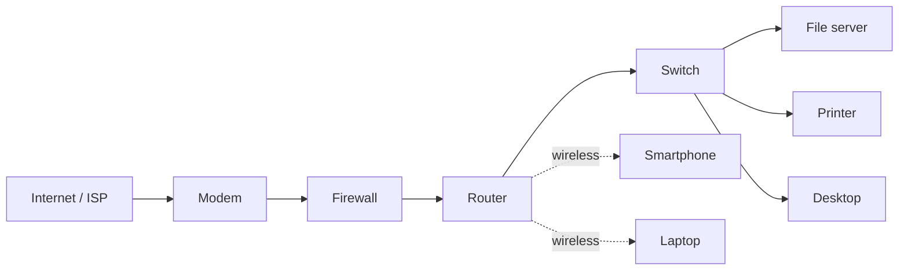
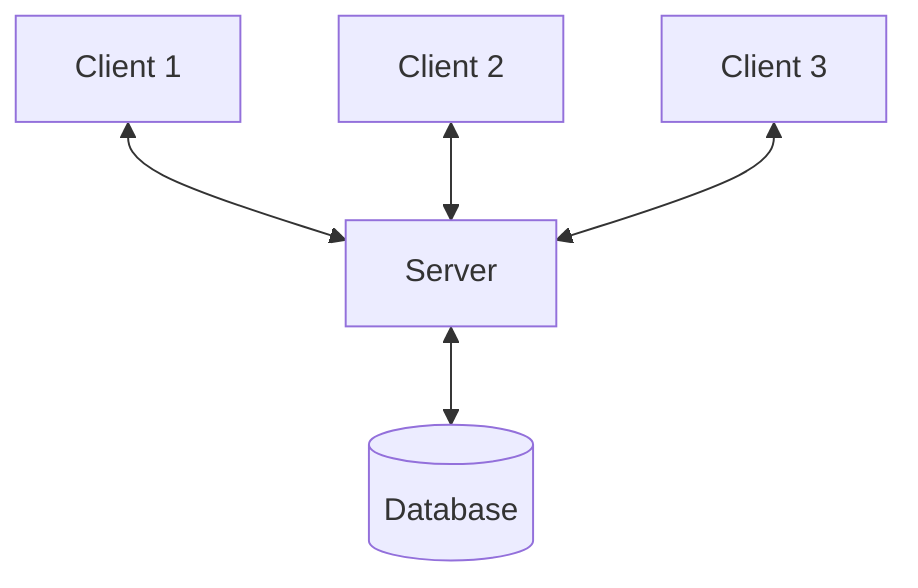

# Course 3 · Module 1 — Network Architecture

Notes from **Connect and Protect: Networks and Network Security**, course 3 of the Google Professional Cybersecurity Certificate.

Diagrams below are redrawn in Mermaid rather than copied from the course material.

---

## What this module covered

How data physically and logically moves across a network: the devices that carry it, the two reference models used to describe that movement (TCP/IP and OSI), and the structure of the IP packet itself. This is the vocabulary layer — you can't read a firewall log, a Wireshark capture or a SIEM alert without it.

---

## Network devices

A typical small network, from the internet inward:

| Device | What it does | TCP/IP layer |
|---|---|---|
| **Modem** | Modulator/demodulator. Converts digital data to an analog signal suited to the ISP's medium (phone line, coax, fibre) and back again. Provides the link to the ISP. | Network access |
| **Router** | Connects *different* networks and forwards packets between them based on the **destination IP address** in the IP header. | Internet |
| **Switch** | Forwards frames between devices on the *same* network. Maintains a **MAC address table** mapping MAC addresses to physical ports, so traffic goes only to the intended device. | Network access |
| **Hub** | Older shared-medium device. Repeats every incoming signal out of **all** ports. | Network access |
| **Firewall** | Inspects traffic entering and leaving the network and permits or denies it against a ruleset. | Varies by type |
| **Wireless access point (WAP)** | Converts data between wired Ethernet and radio waves using the Wi-Fi standards (Wi-Fi 6, Wi-Fi 7). Connects back to a router or switch by cable. | Network access |
| **Server** | Provides resources or services to other devices. The requesting device is the **client**. | — |

### Why a hub is a security problem

A hub repeats every frame out of every port, so any device plugged into it can passively capture traffic meant for other devices. A switch forwards by MAC address, so it limits what an attacker on the same segment can passively see. This is why hubs are effectively obsolete outside tiny legacy setups — the fix for eavesdropping was architectural, not a patch.

### Firewalls

- First line of defence at the network boundary.
- Sits between the internal network and untrusted external networks (the internet).
- Restricts specific inbound and outbound traffic by rule.
- A firewall enforces policy; it does not by itself tell you an attack succeeded. That's what logs and detection tooling are for.

### Client–server model

---

## Cloud computing

**Cloud computing** — using servers, applications and network services hosted over the internet instead of on local physical hardware. A **cloud service provider (CSP)** operates the data centres.

Traditional setups where all equipment sits in a company's own premises are **on-premise networks**.

| Model | What the CSP provides | Example of what you manage |
|---|---|---|
| **IaaS** — Infrastructure as a Service | Virtual compute, storage, networking | OS, runtime, applications, data |
| **PaaS** — Platform as a Service | The above plus OS and development tooling | Your application and its data |
| **SaaS** — Software as a Service | A complete running application | Your data and user access only |

The higher up that list you go, the less you manage — and the more of the security burden shifts to the provider. But **never all of it**: identity, access control and your own data stay yours under every shared responsibility model. Cloud misconfiguration (a storage bucket left public, over-permissive IAM) is one of the most common real-world breach causes.

Related terms:

- **Hybrid cloud** — CSP services used alongside on-premise infrastructure.
- **Multi-cloud** — more than one CSP in use.
- **Software-defined network (SDN)** — network devices (switches, routers, firewalls) delivered as virtual services running on the CSP's infrastructure rather than as physical boxes.

---

## The TCP/IP model

A four-layer framework describing how data is organised and transmitted across a network. Its purpose is shared vocabulary — it lets engineers and analysts say *where* a problem or a threat is occurring.

| Layer | Responsibility | Protocols / examples |
|---|---|---|
| **4. Application** | Makes and responds to network requests; defines how applications exchange data | HTTP, HTTPS, TLS, DNS, SMTP, SSH, FTP |
| **3. Transport** | Delivers data between two systems; flow control and segmentation | TCP, UDP |
| **2. Internet** | Addresses and routes packets to the destination host, possibly on another network | IP (v4/v6), ICMP, (ARP sits at the boundary with the layer below) |
| **1. Network access** | Creates and transmits frames over the physical medium | Ethernet, Wireless LAN |

> **Terminology warning:** the TCP/IP model has **no** "data link layer" — that's OSI vocabulary. In TCP/IP terms, switches operate at the **network access layer**. Mixing the two models' names is a common and very visible mistake.

### Key protocols

**IP (Internet Protocol)** — delivers packets to the correct destination network and host. Relies on TCP or UDP above it to hand data to the right service. Best-effort: it does not guarantee delivery.

**ICMP (Internet Control Message Protocol)** — carries error and status messages about packet delivery. Reports dropped packets, unreachable hosts, redirects. The mechanism behind `ping` and `traceroute`. Also abused: ICMP tunnelling can smuggle data out of a network, and ICMP sweeps are a common reconnaissance technique.

**TCP (Transmission Control Protocol)** — connection-oriented. Establishes a connection before sending, tracks delivery, retransmits lost or corrupted segments. Carries the destination port number in the TCP header.

**UDP (User Datagram Protocol)** — connectionless. No handshake, no delivery tracking. Lower overhead, so it suits real-time and performance-sensitive traffic (video streaming, VoIP, DNS queries).

### Common ports

| Port | Service |
|---|---|
| 20 / 21 | FTP — data transfer / control |
| 22 | SSH |
| 25 | SMTP (email) |
| 53 | DNS |
| 80 | HTTP |
| 443 | HTTPS |

Unexpected traffic on a well-known port — or a well-known service running on an odd port — is a routine detection signal.

---

## The OSI model

Seven layers. More granular than TCP/IP, and still the standard way professionals describe where a fault or threat sits ("that's a layer 7 attack").

| # | Layer | Responsibility |
|---|---|---|
| 7 | **Application** | Protocols applications use to reach the network — HTTP/HTTPS, SMTP, DNS |
| 6 | **Presentation** | Data translation, formatting, compression, encryption (e.g. SSL/TLS for HTTPS) |
| 5 | **Session** | Establishes, maintains and terminates connections; authentication, reconnection, checkpoints |
| 4 | **Transport** | Delivery between devices; speed, flow control, **segmentation** into smaller pieces |
| 3 | **Network** | Receives frames from layer 2 and delivers packets to the destination using IP addresses |
| 2 | **Data link** | Moves data within a single network; home of switches and network interface cards |
| 1 | **Physical** | The cabling, hardware and signalling — data as a stream of 0s and 1s |

### Mapping the two models

| TCP/IP | OSI |
|---|---|
| Application | Application (7), Presentation (6), Session (5) |
| Transport | Transport (4) |
| Internet | Network (3) |
| Network access | Data link (2), Physical (1) |

TCP/IP is a condensed version of OSI. Both split network communication into layers; TCP/IP is what's actually implemented, OSI is the finer-grained teaching and troubleshooting model.

---

## Operations at the network layer

Functions here handle addressing and delivery of packets from the source host to the destination host — router to router across the internet until the packet reaches the destination IP address. Routers store path information in **routing tables**.

Every packet carries an IP address. The header carries more than the destination: source IP, packet size, and which protocol handles the data portion.

### IPv4 packet structure

An IPv4 packet has two parts: **header** and **data**.

- Header: **20–60 bytes**. The first 20 are fixed; the optional last 0–40 bytes are the options field.
- Total packet size: up to **65,535 bytes**.

The 13 header fields:

| Field | Purpose |
|---|---|
| **Version (VER)** | 4 bits. Which IP version the packet uses. |
| **IHL / HLEN** | Header length — marks where the header ends and data begins. |
| **Type of Service (ToS)** | Priority information routers use for quality of service. |
| **Total Length** | Length of the entire packet, header plus data. |
| **Identification** | Unique ID shared by all fragments of an original packet, so they can be reassembled. |
| **Flags** | Whether the packet has been fragmented and whether more fragments follow. |
| **Fragment Offset** | Where in the original packet this fragment belongs. |
| **Time to Live (TTL)** | Counter set by the sender, decremented by one at each router. At zero the packet is discarded and an ICMP Time Exceeded message is returned to the sender. Prevents packets looping forever. |
| **Protocol** | Which protocol handles the data portion (TCP, UDP, ICMP…). |
| **Header Checksum** | Detects corruption of the header in transit. Corrupted packets are discarded. |
| **Source Address** | Sender's IPv4 address. |
| **Destination Address** | Recipient's IPv4 address. |
| **Options** | Optional routing/security directives; present only when IHL is greater than five. |

TTL is worth remembering beyond the exam — it's what makes `traceroute` work, and unusual TTL values in captured traffic can indicate spoofing or an unexpected number of hops.

### IPv4 vs IPv6

| | IPv4 | IPv6 |
|---|---|---|
| Address format | Four decimal numbers, 0–255, separated by dots | Eight groups of up to four hex digits, separated by colons |
| Address size | 32 bits (4 bytes) | 128 bits (16 bytes) |
| Address space | ~4.3 billion | ~340 undecillion (340 followed by 36 zeros) |
| Example | `198.51.100.0` | `2002:0db8:0000:0000:0000:ff21:0023:1234` |
| Header | 13 fields, variable 20–60 bytes | 8 fields, fixed 40 bytes |

The IPv6 header is simpler. It drops IHL, Identification and Flags, and adds the **Flow Label**, which marks a packet as needing special handling by IPv6 routers. Fields renamed: ToS → Traffic Class, Total Length → Payload Length, Protocol → Next Header, TTL → Hop Limit.

IPv6 gives more efficient routing and removes the private-address collisions that occur under IPv4 when two devices attempt to use the same address.

---

## Key terms

| Term | Definition |
|---|---|
| **Data packet** | Basic unit of information travelling between devices. Header, body, footer. |
| **Header** | Carries IP address, MAC address and protocol number. |
| **Bandwidth** | The **maximum capacity** of a network connection. Not the same as throughput, which is the rate actually achieved. |
| **Packet sniffing** | Capturing and inspecting packets crossing a network. A legitimate analyst technique and an attacker technique, depending on who's doing it. |
| **Port** | Software-based location organising the sending and receiving of data between devices. |
| **MAC address** | Hardware identifier used to forward frames within a single network. |
| **ARP** | Maps IP addresses to MAC addresses for local communication. Operates at the network access layer. |
| **Analog vs digital signal** | Analog is continuous; digital is discrete, represented in binary. |

---

