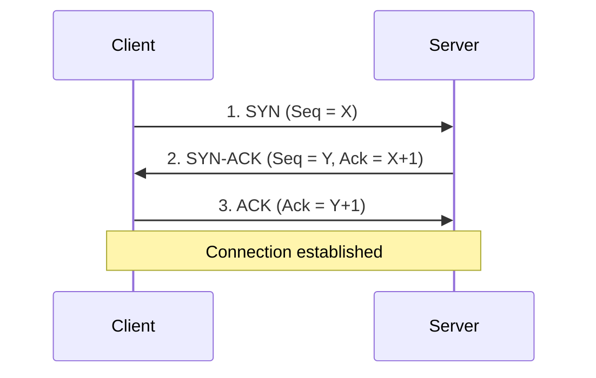
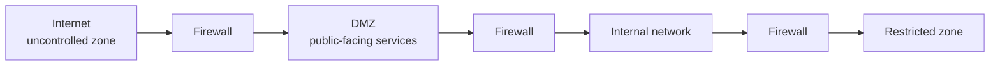

# Course 3 · Module 2 — Network Operations

Notes from **Connect and Protect: Networks and Network Security**, course 3 of the Google Professional Cybersecurity Certificate.

Diagrams are redrawn in Mermaid rather than copied from the course material.

> **A note on layer numbering.** The Google course numbers the TCP/IP model from the bottom up: 1 network access, 2 internet, 3 transport, 4 application. OSI numbers its seven layers the other way, so OSI layer 7 is the application layer. When a protocol is described below as "application layer", that's TCP/IP layer 4 *or* OSI layer 7 — same place, different numbering. Mixing the two is a common interview stumble.

---

## What this module covered

The protocols that actually carry traffic, the port numbers that identify them, and the controls built on top — firewalls, VPNs, security zones, subnetting and proxies. Module 1 was the map; this is what moves across it and how you restrict that movement.

---

## Network protocols

A **network protocol** is a set of rules governing how two or more devices exchange data — the order of delivery and the structure of the data. Protocols are the shared language that lets devices anywhere interoperate. They act as instructions travelling alongside the data in the packet, telling the receiving device what to do with it.

Three categories:

### 1. Communication protocols

Govern the exchange of information: how data is transmitted, the timing, and recovery of data lost in transit.

**TCP (Transmission Control Protocol)** — transport layer. Establishes a connection before streaming data, using a **three-way handshake**:

The sequence numbers let both sides track and reassemble data, and detect anything lost.

**UDP (User Datagram Protocol)** — transport layer. Connectionless: no handshake, no delivery tracking. It wraps the data and fires it at the destination IP and port. Less reliable, but faster and lower overhead, so it suits traffic that must arrive quickly — DNS queries, video, VoIP.

**HTTP (Hypertext Transfer Protocol)** — application layer, **port 80**. Communication between clients and web servers. Insecure; largely replaced by HTTPS.

> **Useful analogy from the course:** TCP is the phone connection established when you dial and the other person picks up. HTTP is the language you then speak to ask for what you want.

**DNS (Domain Name System)** — translates domain names into IP addresses. A client queries a DNS server, which returns the IP for that domain. Normally **UDP port 53**; falls back to **TCP port 53** for zone transfers and responses too large for a single UDP datagram.

### 2. Management protocols

Used to monitor and manage network activity — error reporting and performance.

**SNMP (Simple Network Management Protocol)** — application layer. Monitors and manages network devices. Can reset a password on a device, change its baseline configuration, or request a report on bandwidth use. That capability cuts both ways: SNMP with default community strings (`public`/`private`) is a classic soft target.

**ICMP (Internet Control Message Protocol)** — internet layer. Devices use it to report data transmission errors to each other. The receiving device sends a report back to the sender about the transmission. The mechanism behind `ping`, and a standard first step in troubleshooting connectivity and latency.

### 3. Security protocols

Use encryption to protect data in transit.

**HTTPS** — application layer, **port 443**. HTTP secured with SSL/TLS encryption on all transmissions, so an interceptor cannot read the contents.

**SFTP (Secure File Transfer Protocol)** — application layer. File transfer over **SSH, TCP port 22**. SSH uses AES and other encryption so unintended recipients cannot read the transmission. Commonly used with cloud storage: every upload and download is an SFTP transfer.

> **Important limitation, and it's the one people forget:** these encryption protocols do **not** conceal the source or destination IP address. An attacker intercepting the traffic still learns who is talking to whom, when, and how much — even if the contents are unreadable. That metadata is often enough.

### SSL and TLS

Cryptographic protocols that encrypt data sent over a network.

- **SSL** — created by Netscape in 1995. Severe vulnerabilities were found in SSL 2.0 and 3.0. Formally deprecated since 2015 and completely obsolete.
- **TLS** — introduced 1999 as the replacement. Current standard is **TLS 1.3** (2018).

People still say "SSL" out of habit when they mean TLS. Knowing that SSL is dead, and why, is worth more than knowing the acronym.

---

## Additional protocols

### NAT (Network Address Translation)

Devices on a local network each hold a private IP address used to talk to each other directly. To reach the public internet they need a **single public IP address representing all devices on the LAN**.

For outgoing traffic the router replaces the private source IP with its public IP, and reverses the operation for the responses. It requires a router or firewall configured to perform NAT.

| | Private IP addresses | Public IP addresses |
|---|---|---|
| Assigned by | The router | ISP and IANA |
| Uniqueness | Unique only within the private network | Globally unique |
| Cost | Free | Costs to lease |
| Ranges | `10.0.0.0`–`10.255.255.255` `172.16.0.0`–`172.31.255.255` `192.168.0.0`–`192.168.255.255` | Everything else, minus other reserved blocks |

> The three private ranges above (defined in RFC 1918) are the ones worth memorising — you'll recognise them instantly in logs. "Everything else is public" is a simplification: `127.0.0.0/8` is loopback, `169.254.0.0/16` is link-local, `224.0.0.0/4` is multicast, and several other blocks are reserved.

### DHCP (Dynamic Host Configuration Protocol)

Application layer, **UDP ports 67 (server) and 68 (client)**. Works with the router to assign each device a unique IP address, and supplies the address of the appropriate DNS server and the default gateway (the internal IP of your router).

### ARP (Address Resolution Protocol)

Each device has a public IP, a private IP and a MAC address. The IP address may change over time; the MAC address is fixed to the network interface card.

MAC addresses are used to communicate within the same network, but the MAC for a given IP isn't always known — which is what ARP is for. ARP is a **network access layer** protocol that translates IP addresses found in packets into the MAC address of the hardware. Each device keeps matched IP/MAC pairs in an **ARP cache**.

ARP has no port number.

> **Correction to a common note:** ARP has no port number because **ports are a transport-layer concept** — they belong to TCP and UDP. ARP sits below the transport layer, so there's nothing to number. (You'll see this explained as "ports are associated with the application layer" — that's wrong, and Security+ tests the distinction.)
>
> Worth knowing: because the ARP cache accepts replies without verification, **ARP spoofing** lets an attacker on the same network associate their MAC with another device's IP and intercept traffic. It's one of the foundational local-network attacks.

### Remote access

| Protocol | Port | Notes |
|---|---|---|
| **Telnet** | TCP 23 | Application layer. Connects to a remote system using command-line prompts. **Sends everything in clear text**, credentials included. |
| **SSH (Secure Shell)** | TCP 22 | Application layer. Encrypted authentication and communication. The replacement for Telnet. |

Telnet open on a host is a finding, not a feature. If you see port 23 listening in a scan, that's something to raise.

### Email protocols

**POP (Post Office Protocol)** — application layer. Retrieves email from a mail server and **downloads it locally**. POP3 is the common version. Mail must finish downloading before it can be read, and after downloading it may or may not be deleted from the server — so it does not guarantee syncing across devices.
Ports: **110** unencrypted, **995** over SSL/TLS.

**IMAP (Internet Message Access Protocol)** — downloads email headers and content while **leaving the content on the server**, so users can read mail from multiple devices and sync across them. Allows partial reading before the download finishes.
Ports: **143** unencrypted, **993** over TLS.

**SMTP (Simple Mail Transfer Protocol)** — transmits and routes email from sender to recipient. Works with Message Transfer Agent (MTA) software, which queries DNS to resolve email addresses to IP addresses. Helps filter spam by rate-limiting how much a source can send.
Ports: **25** (server-to-server, and heavily abused by high-volume spam), **587** for authenticated submission over TLS.

> SMTP, POP3 and IMAP are **TCP only**. Course material sometimes writes "TCP/UDP" for these — that's an error.

---

## Protocols and port numbers

Port numbers tell network devices what to do with the data in each packet once it arrives. Firewalls filter unwanted traffic based on them.

| Protocol | Port |
|---|---|
| FTP | TCP 20 (data), 21 (control) |
| SSH / SFTP | TCP 22 |
| Telnet | TCP 23 |
| SMTP | TCP 25 (unencrypted), 587 (TLS submission) |
| DNS | UDP 53 (TCP 53 for zone transfers) |
| DHCP | UDP 67 (server), 68 (client) |
| HTTP | TCP 80 |
| POP3 | TCP 110 (unencrypted), 995 (SSL/TLS) |
| IMAP | TCP 143 (unencrypted), 993 (SSL/TLS) |
| HTTPS | TCP 443 |
| ARP | none — not a transport-layer protocol |

### The addressing analogy

- **MAC address** — the latitude and longitude of the building.
- **IP address** — the street address. Gets the mail truck (the packet) to the front door.
- **Port number** — the apartment number inside. Without it the carrier doesn't know which tenant gets the package.

Ports are what make **multiplexing** possible: many applications sharing one physical connection.

---

## Firewalls

A network security device that monitors traffic to and from a network. Can be a hardware device or a **network virtual appliance (NVA)**.

**Port filtering** — a firewall function that blocks or allows specific port numbers to limit unwanted communication.

| Type | How it works |
|---|---|
| **Stateless** | Operates on predefined rules only. Keeps no record of previous packets. |
| **Stateful** | Tracks information passing through it in a **state table**, so it can relate a response to the request that prompted it. Needs rules in only one direction, which makes it both simpler to manage and more capable. |
| **Next-generation (NGFW)** | Adds deep packet inspection and intrusion prevention. Inspects at the application layer and is application-aware — rules can allow or block by *application*, not just IP and port. |
| **Cloud-based** | Software firewalls hosted by a cloud service provider. |

The stateless → stateful → NGFW progression is worth understanding as a story: each step adds context. Stateless sees a packet. Stateful sees a conversation. NGFW sees which application is having it.

---

## VPNs

A **VPN** is a network security service that changes your public IP address and masks your virtual location, keeping data private on a public network.

**Encapsulation** — the VPN wraps your unencrypted data inside an encrypted packet so it can cross the public network protected. Primary purpose: protect data in transit from exposure, alteration or tampering.

> A VPN protects data in transit and hides your IP from the destination. It does **not** make you anonymous — your VPN provider can see what you do, and browser fingerprinting, cookies and logins identify you regardless. Be precise about this; overclaiming it is a giveaway that someone learned VPNs from advertising.

**VPN protocol** — the rules determining how data moves between endpoints, and how the secure tunnel is formed.

| Type | Use |
|---|---|
| **Remote access VPN** | An individual connects a personal device to a VPN server over the internet. Encrypts traffic sent and received by that device. |
| **Site-to-site VPN** | Extends an enterprise network to other networks and locations. Useful for organisations with many offices. Harder to configure and manage. Usually built on IPSec. |

| Protocol | Notes |
|---|---|
| **IPSec** | Used by most VPN providers to encrypt and authenticate packets. One of the earlier protocols, so support is near-universal. Older, more complex, with a long history of security testing behind it. |
| **WireGuard** | Open source, high speed, modern encryption. Simple to set up and maintain. Works for both site-to-site and client-server. Faster, with a far smaller codebase. |

**SD-WAN (software-defined wide area network)** — a virtual WAN service securely connecting users to applications across multiple locations and long distances.

---

## Security zones and network segmentation

**Network segmentation** — dividing a network into segments.
**Security zone** — a segment of a network that protects the internal network from the internet.

- **Uncontrolled zone** — any network outside the organisation's control, e.g. the internet.
- **Controlled zone** — a subnet protecting the internal network from the uncontrolled zone.

Inside the controlled zone:

- **DMZ (demilitarised zone)** — a buffer between the external network and the internal network. Hosts public-facing services that must be reachable from the internet.
- **Internal network** — private data and resources. Highly protected, not directly reachable from the internet.
- **Restricted zone** — highly confidential information, accessible only to employees with specific privileges.

> The DMZ is the outer courtyard. Accessible from outside, but still defended — and an intruder who reaches it still hasn't reached the keep.

This is defence in depth expressed as architecture: an attacker who compromises a web server in the DMZ has to cross another firewall to reach anything that matters.

---

## Subnetting

Creating security zones is one application of subnetting.

**Subnetting** — dividing one large network into several smaller organised groups called **subnets**. A subnet is defined by the combination of **IP address and network mask** assigned to each device. Each subnet functions as its own network.

**CIDR (Classless Inter-Domain Routing)** — a method of assigning subnet masks to create subnets. Classless addressing replaced classful addressing and expanded the number of usable IPv4 addresses.

Example: IPv4 address `198.51.100.0` written in CIDR as `198.51.100.0/24`, which covers every address from `198.51.100.0` to `198.51.100.255`.

**Security benefits:** lets analysts create a network within their own network, uses bandwidth more efficiently, and improves performance. It's one component of isolating subnetworks, alongside physical isolation, routing configuration and firewalls.

Practically: segmentation limits **lateral movement**. An attacker who lands on one machine can only reach what that segment can reach.

---

## Proxy servers

A server that fulfils a client's request by forwarding it on to other servers. Uses NAT to act as a barrier between clients and external threats.

- Hides private IP addresses
- Blocks unsafe websites
- **Caches** frequently requested data in temporary memory

| Type | Purpose |
|---|---|
| **Forward proxy** | Regulates and restricts a person's access to the internet |
| **Reverse proxy** | Regulates and restricts the internet's access to an internal server |

Easy way to keep them straight: a forward proxy protects the *users* from the internet; a reverse proxy protects the *server* from the internet.

---

## Wireless security protocols

**Wi-Fi** is a set of standards defining communication for wireless LANs — a marketing term from the Wireless Ethernet Compatibility Alliance (WECA), now the Wi-Fi Alliance. The underlying standards are the **IEEE 802.11** family, so you'll see Wi-Fi referred to as **IEEE 802.11**.

| Protocol | Year | Notes |
|---|---|---|
| **WEP** (Wired Equivalent Privacy) | 1999 | Oldest wireless security standard, intended to give wireless the same privacy as wired. Out of use today — broken. |
| **WPA** | 2003 | Built to address WEP's flaws, which were in the protocol itself and how encryption was used. Introduced **TKIP**, larger secret keys, and a message integrity check with an authentication tag on each transmission. Always intended as a transitional measure for backwards compatibility. Vulnerable to the **KRACK** (key reinstallation) attack: an attacker inserts themselves into the authentication handshake and installs a new key — set it to all zeros and the traffic is effectively unencrypted. |
| **WPA2** | 2004 | Improves WPA by using **AES** and replacing TKIP with **CCMP**, providing encapsulation plus message authentication and integrity. Also affected by KRACK. |
| **WPA3** | 2018 | Developed in response to the KRACK weaknesses in WPA2. |

### Personal vs enterprise mode

| | **Personal** | **Enterprise** |
|---|---|---|
| Best for | Home networks | Business networks |
| Setup | Quick and easy | More complicated |
| Authentication | A single **global passphrase** applied to every computer and access point on the network | Individualised, centrally controlled |
| Access management | None — changing access means changing the passphrase everywhere | Administrators can grant or remove a user's access at any time |
| Limitation | Unmanageable at organisational scale | Requires supporting infrastructure |

The shared-passphrase problem is the point: with personal mode, an employee leaving means re-keying every device on the network, and any one person who knows the passphrase can hand out access. Enterprise mode gives each user their own credentials, which is what makes revocation possible.

### WPA3

- Addresses the **authentication handshake vulnerability to KRACK attacks** present in WPA2.
- Uses **SAE (Simultaneous Authentication of Equals)**, a password-authenticated cipher-key-sharing agreement, in place of WPA2's pre-shared key handshake.
- SAE prevents attackers from capturing data from wireless connections and taking it away to decode offline at their leisure — the capture-now-crack-later attack that worked against WPA2.
- Increased encryption strength: **128-bit**, with WPA3-Enterprise offering optional **192-bit**.

> SAE is worth understanding one level deeper than the bullet point, because it's a good example of a real cryptographic fix. Under WPA2, an attacker could capture the four-way handshake and then brute-force the passphrase offline, with unlimited time and no contact with the network. SAE makes each guess require a fresh interaction with the access point, so offline cracking stops working. It also gives **forward secrecy** — traffic captured today can't be decrypted later even if the passphrase is eventually discovered.

The pattern across WEP → WPA → WPA2 → WPA3 is the one to take away: each standard was broken by researchers, and its replacement was designed around that specific break. Security standards aren't handed down finished — they're the current state of an ongoing argument.

---

## Key terms

| Term | Definition |
|---|---|
| **Network protocol** | Rules governing data delivery order and structure between devices |
| **Three-way handshake** | SYN → SYN-ACK → ACK; how TCP establishes a connection |
| **Multiplexing** | Sharing one physical connection among many applications, made possible by ports |
| **Port filtering** | Firewall function blocking or allowing specific port numbers |
| **State table** | A stateful firewall's record of active connections |
| **Encapsulation** | Wrapping unencrypted data inside an encrypted packet, as a VPN does |
| **Network segmentation** | Dividing a network into segments to limit access and movement |
| **Subnet** | A smaller network within a network, defined by IP address plus network mask |
| **CIDR notation** | Subnet mask written as a suffix, e.g. `/24` |

---
- Note: The notes have been edited and modified by AI, and the diagrams have been redrawn through Mermaid

